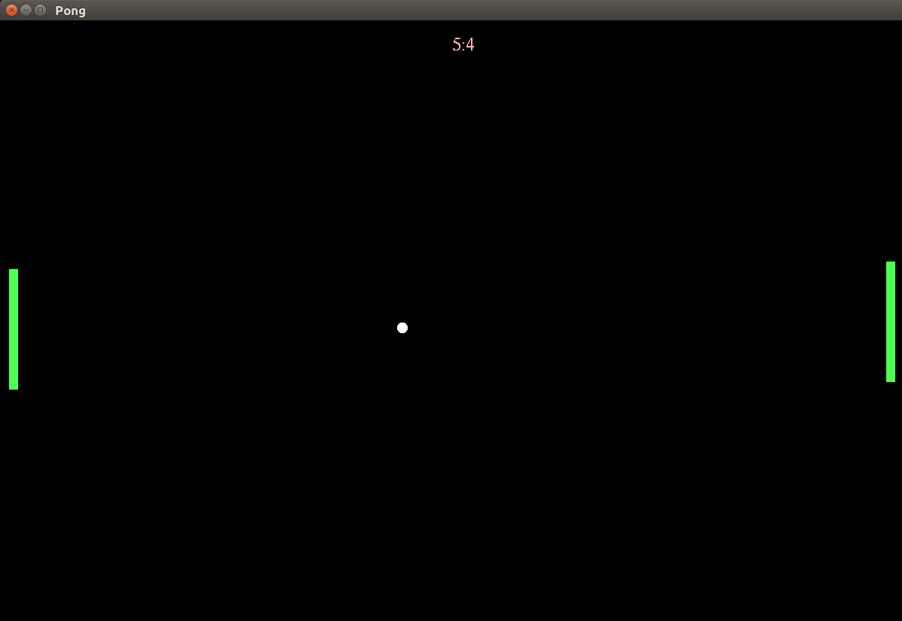

# Pong in C++
## Screenshots


## Description
Simple game of pong implemented completely in C++ and Glut. The purpose of this project is twofold. 

1. Learn C++ with a minimum of external libraries and packages. This means that only what is *absolutely required* is included.
2. Implement some basic AI opponents against the human player. So far only a basic look ahead algorithm is implemented in trainer.cpp.

As such, there are two modes of controlling the paddles.

1. Human control using the &uparrow; and &downarrow; keys to control the paddle (only enabled for right paddle).
2. Perfect AI, which has access to the ball's position and speed. It is a simple calculation that yields the intercept point with the wall. Based on the paddle's current position, the direction of motion can be computed. 
3. Learned AI, which does not *know* the formula for ball intercepts and must learn it. 

## Playground
To facilitate learning algorithms, the game has the option to play with Perfect AI on both paddles, recording each state of the game in a binary file. These files can then be used to train a variety of algorithms to learn to play for Learned AI.

Simply runnning ```./pong ai``` will run the AI on both paddles. This will generate a stream of (up to 100) games which are automatically saved in the data directory. 

## Prerequisites 
* OpenGL
* Freeglut
* GCC

## Compile + Run (for Linux, see Notes)
Compile using

```$make all```

followed by one of 

```
$./pong human
```

gives you control of the right paddle via &uparrow; and &downarrow; on the keyboard.

```
$./pong ai
```

gives control of the right paddle to the perfect AI.

```
$./pong learn
```

gives control of whatever learning algorithm is implemented in trainer.cpp.


## Playback stored game
```
$./play 122
```

will run 

> data/122.bin.

## Notes
* Currently the perfect solution is implemented where the paddle has access to the ball trajectory. In order to make thing more fair, a "handicap" is implemented for the AI (basically forcing it to play at a slower speed).

* Since C++ is platform dependent, the functionality may vary. As far as I know, I used standard Glut components which should make it operate across platforms. **I haven't tested this!**